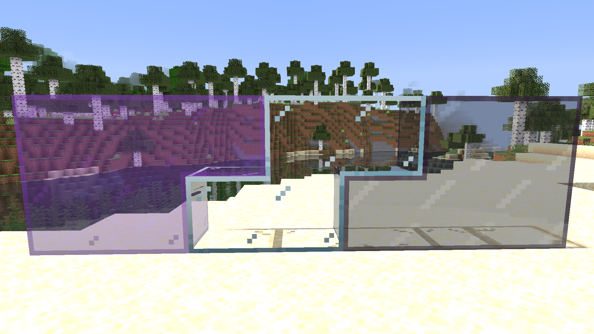

# Contenuto

=== "Mod di feature"
    ### [AmbientSounds](https://modrinth.com/mod/ambientsounds)
    Suoni d'ambiente più immersivi.
    
    ---
    ### [AppleSkin](https://modrinth.com/mod/appleskin)
    Tooltip per i cibi:  
      
    Visualizzazione di saturazione e affaticamento:  
      
    Overlay del recupero di fame, saturazione e vita che un cibo darebbe se mangiato:  
    
    
    
    ---
    ### [Armor Points ++](https://modrinth.com/mod/armorpoints)
    Visualizzazione della solidità dell'armatura indossata:   
      
    Visualizzazione della protezione dell'armatura indossata:  
      
    Visualizzazione di assorbimento e resistenza:  
    
    
    ---
    ### [Better Mount HUD](https://modrinth.com/mod/better-mount-hud)
    Quando si monta su una qualsiasi cavalcatura (cavalli, maiali, ecc.) o veicolo (barca, carrello, ecc.) la fame rimane visibile.  
    Inoltre, specificamente per le cavalcature, la barra dell'esperienza rimane visibile e viene sostituita da quella del salto solo quando necessario.
    
    ---
    ### [BetterF3](https://modrinth.com/mod/betterf3)
    Migliora l'aspetto e le informazioni mostrate dal menù apribile con F3.

    ---
    ### [Bobby](https://modrinth.com/mod/bobby)
    Permette di avere una distanza di render superiore rispetto a quella del server tramite cache dei chunk.
    
    ---
    ### [Cake Chomps](https://modrinth.com/mod/cake-chomps)
    Suoni per quando si mangia una torta.
    
    ---
    ### [Chat Heads](https://modrinth.com/mod/chat-heads)
    Per ogni messaggio in chat, aggiunge l'icona della testa del giocatore che ha inviato il messaggio.

    ---
    ### [Client Tweaks](https://modrinth.com/mod/client-tweaks)
    Principalmente piccoli QoL visivi in prima persona.

    ---
    ### [Continuity](https://modrinth.com/mod/continuity)
    Rende alcune texture più continue, rimuovendo i bordi netti tra blocchi contigui dello stesso tipo, principalmente per il vetro.  
    
    
    ---
    ### [Dark Loading Screen](https://modrinth.com/mod/dark-loading-screen)
    Rende la schermata di caricamento in dark mode.
    
    ---
    ### [Drip Sounds](https://modrinth.com/mod/dripsounds-fabric)
    Aggiunge dei suoni per le gocce di acqua/lava che cadono.
    
    ---
    ### [Durability Tooltip](https://modrinth.com/mod/durability-tooltip)
    Aggiunge un tooltip che mostra la durabilità degli oggetti senza il bisogno di abilitare F3+H.  
    
    
    ---
    ### [Eating Animation](https://modrinth.com/mod/eating-animation)
    Aggiunge animazioni uniche per ogni cibo quando viene mangiato.
    
    ---
    ### [Emoji Type](https://modrinth.com/mod/emoji-type)
    Permette, durante la scrittura di un messaggio in chat, di digitare `:` per avere il suggerimento di varie emoji disponibili da poter inserire e che saranno visibili a tutti quelli che vedranno il messaggio, incluso che non ha la mod.
    
    ---
    ### [Enchantment Descriptions](https://modrinth.com/mod/enchantment-descriptions)
    Aggiunge un tooltip con la descrizione degli incantesimi.
    
    ---
    ### [Equipment Compare](https://modrinth.com/mod/equipment-compare)
    Permette, tramite la pressione del tasto SHIFT sopra un oggetto da poter equipaggiare, di confrontarlo rapidamente con ciò che si ha già equipaggiato al momento.
    
    ---
    ### [Get Off My Lawn ReServed (GOML)](https://modrinth.com/mod/goml-reserved)
    Mod lato server, ovviamente presente anche sul server, che aggiunge la possibilità di creare e personalizzare claim.  
    Aggiunta anche lato client principalmente per miglioria della sincronia client-server e per permettere ai moderatori di avere gli oggetti della mod in creativa. 
    
    ---
    ### [Harvest with ease](https://modrinth.com/mod/harvest-with-ease)
    Mod lato server, ovviamente presente anche sul server, che permette di mietere i raccolti più facilmente tramite tasto destro con una zappa in mano senza il bisogno di ripiantare.   
    Aggiunta anche lato client principalmente per miglioria della sincronia client-server.
    
    ---
    ### [Inventory Profiles Next](https://modrinth.com/mod/inventory-profiles-next)
    Sostituisce automaticamente gli stack che si esauriscono nella hotbar con un altro stack dello stesso oggetto se presente nell'inventario.
    
    ---
    ### [ItemPhysic Lite](https://modrinth.com/mod/itemphysic-lite)
    Modifica la fisica dei drop rendendola più carina.
    
    ---
    ### [Jade](https://modrinth.com/mod/jade)
    Aggiunge un overlay non invasivo in alto al centro dello schermo che indica cos'è il blocco/l'entità che si sta inquadrando, l'attrezzo necessario per romperlo e raccoglierlo, e, nel caso di casse e altri blocchi con inventario, gli oggetti presenti al suo interno.
    
    ---
    ### [Lighty](https://modrinth.com/mod/lighty)
    Tramite F7 è possibile visualizzare un'overlay che indica il livello di luce dei blocchi circostanti.

    ---
    ### [Name Pain](https://modrinth.com/mod/name-pain)
    Gradualmente colora il nome dei mob dal bianco al rosso man mano che la loro vita diminuisce.  
    Quando un mob, ostile o meno, inizia a perdere vita, il suo nome rimarrà visibile anche se non lo si inquadra direttamente.  
    Per i villager, il nome è sempre visibile anche se non hanno ancora subito danni.
    
    ---
    ### [Not Enough Animations](https://modrinth.com/mod/not-enough-animations)
    Migliora le animazioni in terza persona e ne aggiunge di nuove.
    
    ---
    ### [Reese's Sodium Options](https://modrinth.com/mod/reeses-sodium-options)
    Migliora il menù delle impostazioni grafiche introdotto da [Sodium](https://modrinth.com/mod/sodium).
    
    ---
    ### [Roughly Enough Items (REI)](https://modrinth.com/mod/rei)
    Come non conoscerla? Mod che aggiunge un rapido modo per visualizzare le ricette, sia di crafting che di cottura, smithing, ecc.  
    Inoltre, tramite la pressione sopra di un oggetto nell'inventario rispettivamente del tasto R o del tasto U, permette di visualizzare le ricette per ottenere l'oggetto o di cui l'oggetto faccia parte.  
    Tramite pressione del tasto A è possibile aggiungere ai preferiti una certa ricetta per ritrovarla rapidamente.
    
    ---
    ### [Shulker Box Tooltip](https://modrinth.com/mod/shulkerboxtooltip)
    Aggiunge un tooltip che permette la visualizzazione dei contenuti di una shulker box nell'inventario.
    
    ---
    ### [Sound Physics Remastered](https://modrinth.com/mod/sound-physics-remastered)
    Suoni più immmersivi e adattivi all'acustica dell'ambiente (es. eco nelle caverne).
    
    ---
    ### [Status Effect Bars](https://modrinth.com/mod/status-effect-bars)
    Aggiunge una piccola barra di durata negli effetti da cui un giocatore è affetto.
    
    ---
    ### [Xaero's Minimap](https://modrinth.com/mod/xaeros-minimap)
    Aggiunge una minimappa in alto a sinistra.
    
    ---
    ### [Xaero's World Map](https://modrinth.com/mod/xaeros-world-map)
    Aggiunge una mappa a schermo intero del mondo esplorato consultabile tramite pressione del tasto M.

=== "Mod di ottimizzazione"
    ### [Dynamic FPS](https://modrinth.com/mod/dynamic-fps)
    Riduce automaticamente gli FPS quando la finestra di Minecraft perde il focus (a 1 FPS) o viene minimizzata (0 FPS).
    
    ---
    ### [Entity Culling](https://modrinth.com/mod/entityculling)
    Migliora la logica di culling delle entità evitando rendering inutili.
    
    ---
    ### [FerriteCore](https://modrinth.com/mod/ferrite-core)
    Diminuisce il consumo di RAM.
    
    ---
    ### [ImmediatelyFast](https://modrinth.com/mod/immediatelyfast)
    Migliora le prestazioni l'immediate mode rendering del client.
    
    ---
    ### [Iris Shaders](https://modrinth.com/mod/iris)
    Ottimizza il rendering e permette di utilizzare le shader.
    
    ---
    ### [Lithium](https://modrinth.com/mod/lithium)
    Mod di ottimizzazione generale della logica di gioco.

    ---
    ### [Model Gap Fix](https://modrinth.com/mod/modelfix)
    Rimuove gli errori di rendering dagli oggetti in mano.
    
    ---
    ### [ModernFix](https://modrinth.com/mod/modernfix)
    Mod di ottimizzazione generale di risorse consumate dal gioco.
    
    ---
    ### [More Culling](https://modrinth.com/mod/moreculling)
    Migliora la logica di culling dei blocchi.
    
    ---
    ### [Sodium](https://modrinth.com/mod/sodium)
    Mod di ottimizzazione generale del rendering.
    
    ---
    ### [Sodium Extra](https://modrinth.com/mod/sodium-extra)
    Addon per [Sodium](#sodium) che aggiunge bugfix e più opzioni nel menù delle impostazioni grafiche.

=== "Mod API"
    ### [Architectury API](https://modrinth.com/mod/architectury-api)
    Richiesta dalla mod [Roughly Enough Items (REI)](https://modrinth.com/mod/rei).
    
    ---
    ### [Balm](https://modrinth.com/mod/balm)
    Richiesta dalla mod [Default Options](#default-options).
    
    ---
    ### [Bookshelf](https://modrinth.com/mod/bookshelf-lib)
    Richiesta dalla mod [Enchantment Descriptions](https://modrinth.com/mod/enchantment-descriptions).
    
    ---
    ### [CIT Resewn](https://github.com/dicedpixels/CITResewn/releases/tag/1.20.4-1.1.4-dicedpixels)
    Richiesta dal texture pack [Even Better Enchants](https://modrinth.com/resourcepack/even-better-enchants).

    ---
    ### [CreativeCore](https://modrinth.com/mod/creativecore)
    Richiesta dalle mod [AmbientSounds](https://modrinth.com/mod/ambientsounds) e [ItemPhysic Lite](https://modrinth.com/mod/itemphysic-lite).
    
    ---
    ### [Default Options](https://modrinth.com/mod/default-options)
    Richiesta dal modpack per fornire una configurazione iniziale delle opzioni di gioco senza sovrascriverle quando si aggiorna il modpack.
    
    ---
    ### [Enhanced Block Entities](https://modrinth.com/mod/ebe)
    Richiesta dalle [shader](#__tabbed_1_5) e da [Fresh Animations](https://modrinth.com/resourcepack/fresh-animations).
    
    ---
    ### [Fabric API](https://modrinth.com/mod/fabric-api)
    Richiesta da quasi tutte le altre mod presenti.
    
    ---
    ### [Fabric Language Kotlin](https://modrinth.com/mod/fabric-language-kotlin)
    Richiesta dalle mod [Inventory Profiles Next](https://modrinth.com/mod/inventory-profiles-next) e [libIPN](#libipn).
    
    ---
    ### [FancyMenu](https://modrinth.com/mod/fancymenu)
    Richiesta dal modpack per la personalizzazione dei menù.
    
    ---
    ### [Iceberg](https://modrinth.com/mod/iceberg)
    Richiesta dalla mod [Equipment Compare](https://modrinth.com/mod/equipment-compare).
    
    ---
    ### [Indium](https://modrinth.com/mod/indium)
    Richiesta dalle mod [Continuity](https://modrinth.com/mod/continuity) e [Enhanced Block Entities](#enhanced-block-entities).
    
    ---
    ### [Konkrete](https://modrinth.com/mod/konkrete)
    Richiesta dalla mod [FancyMenu](#fancymenu).
    
    ---
    ### [No Resource Pack Warnings](https://modrinth.com/mod/no-resource-pack-warnings)
    Richiesta dal modpack per evitare scomodi messaggi durante il caricamento e la scelta dei texture pack presenti.
    
    ---
    ### [SuperMartijn642's Config Lib](https://modrinth.com/mod/supermartijn642s-config-lib)
    Richiesta dalla mod [Durability Tooltip](https://modrinth.com/mod/durability-tooltip).
    
    ---
    ### [Entity Model Features (EMF)](https://modrinth.com/mod/entity-model-features)
    Richiesta dalle [shader](#__tabbed_1_5) e da [Fresh Animations](https://modrinth.com/resourcepack/fresh-animations).
    
    ---
    ### [Entity Texture Features (ETF)](https://modrinth.com/mod/entitytexturefeatures)
    Richiesta dalle [shader](#__tabbed_1_5) e da [Fresh Animations](https://modrinth.com/resourcepack/fresh-animations).
    
    ---
    ### [libIPN](https://modrinth.com/mod/libipn)
    Richiesta dalla mod [Inventory Profiles Next](https://modrinth.com/mod/inventory-profiles-next).

=== "Texture Pack"
    ### [3D Default](https://modrinth.com/resourcepack/3d-default)
    Aggiunge una leggera e piacevole tridimensionalità a molti blocchi.
    
    ---
    ### [Bees Reimagined](https://modrinth.com/resourcepack/bees-reimagined)
    Rende le api più carine e piccole.
    
    ---
    ### [Chests Reimagined](https://modrinth.com/resourcepack/chests-reimagined)
    Modifica l'aspetto delle chest e ottimizza le loro animazioni.

    ---
    ### [Default Dark Mode](https://modrinth.com/resourcepack/default-dark-mode)
    Rende la GUI in dark mode.
    
    ---
    ### [Even Better Enchants](https://modrinth.com/resourcepack/even-better-enchants)
    Aggiunge texture uniche per ogni libro incantato a seconda dell'incantesimo.
    
    ---
    ### [Fresh Animations](https://modrinth.com/resourcepack/fresh-animations)
    Aggiunge fantastiche animazioni uniche per ciascun mob.
    
    ---
    ### [Ore Glint](https://modrinth.com/resourcepack/spryzeens-ore-glint)
    Aggiunge un luccichio ai minerali in modo da renderli più riconoscibili.
    
    ---
    ### Ore Glint - Coal Addon
    Addon per [Ore Glint](#ore-glint) che aggiunge il luccichio anche per il carbone.
    
    ---
    ### [Ore Variants](https://modrinth.com/resourcepack/ore-variants)
    Aggiunge un po' di variazione nelle texture dei minerali.
    
    ---
    ### [Rails Reimagined](https://modrinth.com/resourcepack/rails-reimagined)
    Rende la texture delle rotaie tridimensionale.
    
    ---
    ### [Reimagined Fresh Animations Patch](https://modrinth.com/resourcepack/reimagined-fresh-animations-patch)
    Ha effetto su molti mob, cambiandone le texture rendendole più gradevoli, mantenendo la compatibilità con le animazioni introdotte da [Fresh Animations](#fresh-animations).
    
    ---
    ### Reimagined Fixes
    TP esclusivo del modpack per fixare le teste di scheletro altrimenti non visibili per via di [Reimagined FA Patch](#reimagined-fa-patch).
    
    ---
    ### [Torches Reimagined](https://modrinth.com/resourcepack/torches-reimagined)
    Cambia molto leggermente la texture delle torce rendendola più vibrante.
    
    ---
    ### [Translations for Sodium](https://modrinth.com/resourcepack/translations-for-sodium)
    Traduzioni aggiuntive per [Sodium](https://modrinth.com/mod/sodium).

=== "Shader"
    ### [Complementary Shaders Reimagined](https://modrinth.com/shader/complementary-reimagined)
    Shader più o meno leggere a seconda della configurazione scelta (possibile scegliere anche uno dei tanti profili di default a seconda delle performance del proprio dispositivo).  
    Fornisce dettagli e qualità visiva decisamente superiori alle altre shader presenti di default all'interno del modpack.  
    Sono le shader attive di default.

    ---
    ### [Miniature Shaders](https://modrinth.com/shader/miniature-shader)
    Shader molto leggere, ma molto belle e in perfetto stile Minecraft.  
    Per chi ha problemi di performance anche con queste è consigliato, prima di togliere del tutto le shaders, provare ad abbassare il dettaglio delle ombre.  