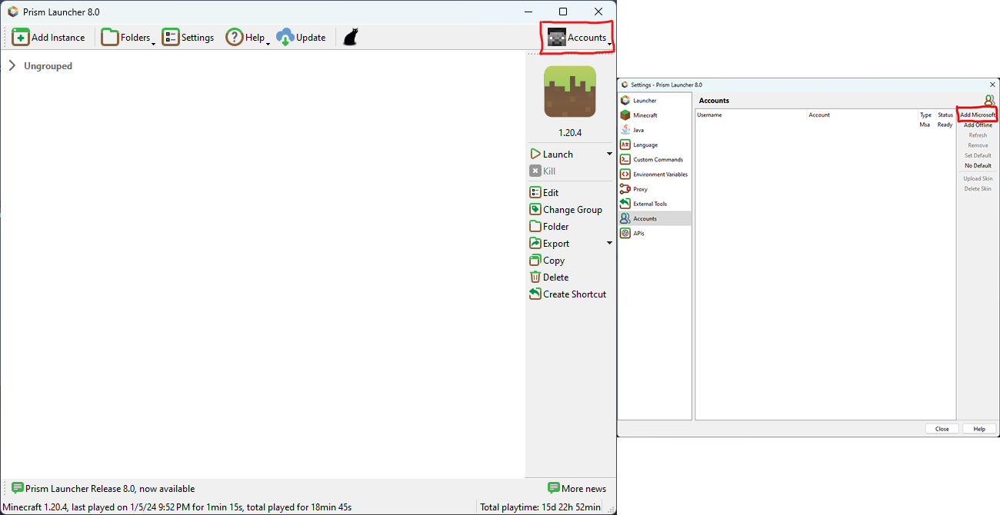

# Installazione
Il [modpack client](https://modrinth.com/modpack/sbekucraft) è hostato sulla piattaforma [Modrinth](https://modrinth.com).  
Per installarlo è necessario quindi un launcher apposito che supporti il download e l'installazione dei modpack Modrinth.  
A seconda del launcher di propria preferenza, è possibile seguire la guida sotto per installare e avviare il modpack.

=== "Modrinth Launcher"
    [Modrinth App](https://modrinth.com/app) è il launcher ufficiale per la gestione dei modpack di Modrinth.  
    Permette anche l'importazione di profili dagli altri launcher più utilizzati, si integra alla perfezione con la piattaforma Modrinth stessa ed è open source.  
    Dopo averla installato, sarà necessario loggare col proprio account Minecraft tramite icona in alto a sinistra.  
    Successivamente, dalla pagina di ricerca, sarà possibile immettere *Sbekucraft* e installare il modpack.  
    Dopo averlo installato, esso sarà disponibile nella home e nella libreria per poter essere avviato.

=== "Prism Launcher"
    [Prism Launcher](https://prismlauncher.org) consente di creare diverse istanze di minecraft ognuna con la propria cartella isolata, e di accedervi da un'interfaccia intuitiva.
    Grazie alle integrazioni con le piattaforme di modding è anche possibile scaricare direttamente dal launcher tutto il necessario per moddare o addirittura scaricare direttamente modpack.

    Una volta scaricato ed installato il launcher, basta seguire queste semplici istruzioni:

    
    Per prima cosa bisogna accede al proprio account microsoft per poter verificare la propria licenza di gioco.

    Una volta effettuato l'accesso, tramite la sezione "aggiungi istanza", è possibile scegliere dalla lista a sinistra "Modrinth" come sorgente di modpack e poi cercare "Sbekucraft" tramite la barra di ricerca.
    Infine, selezionare OK tramite il pulsante situato in basso a destra.

    Prism Launcher scaricherà il modpack automaticamente, e basterà fare doppio click sull'icona spuntata nella home del programma per avviare il modpack.

=== "AT Launcher"
    TODO
